# Grocy-Mart Security & Architecture Flowcharts

> View this file in VS Code with **Markdown Preview Mermaid Support** extension
> Or open `flowcharts.html` in browser for live diagrams

---

## 1. Overall System Architecture

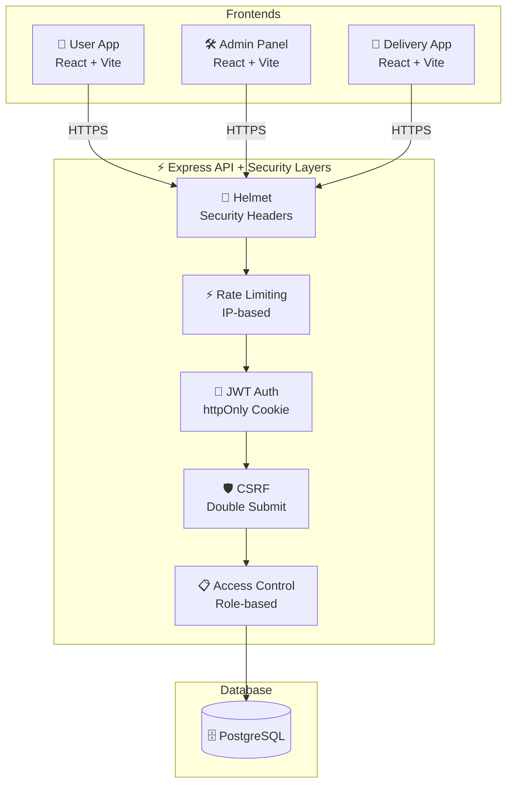

---

## 2. Authentication Flow (Updated)

```mermaid
sequenceDiagram
    participant U as 👤 User
    participant F as Frontend
    participant B as Backend
    participant D as DB
    
    rect rgb(50, 50, 50)
        Note over U,B: Login Flow
        U->>F: Enter email/password
        F->>B: POST /api/auth/login
        B->>D: Validate credentials
        D-->>B: User data
        
        alt Admin User
            B->>B: Generate 2FA OTP
            B-->>F: require2FA: true
            F->>U: Enter OTP
            F->>B: POST /verify-2fa
            B->>B: Validate OTP
        end
        
        B->>B: Generate JWT + Refresh Token
        B-->>F: Set httpOnly cookie + Refresh Token
        F-->>U: Login success
    end
    
    rect rgb(0, 50, 0)
        Note over U,B: Token Refresh
        F->>B: POST /api/auth/refresh
        B->>B: Validate Refresh Token
        B->>B: Generate New JWT
        B-->>F: New Tokens
    end
    
    rect rgb(50, 0, 0)
        Note over U,B: Logout
        F->>B: POST /api/auth/logout
        B->>B: Add to Blacklist
        B->>B: Clear Cookie
        B-->>F: Logged out
    end
```

---

## 3. Order Placement Flow (Updated)

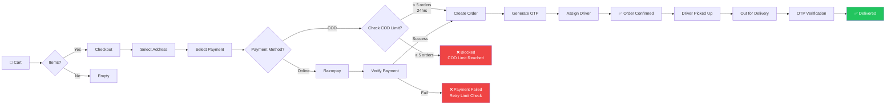

---

## 4. Security Middleware Flow (Updated - FIXED!)

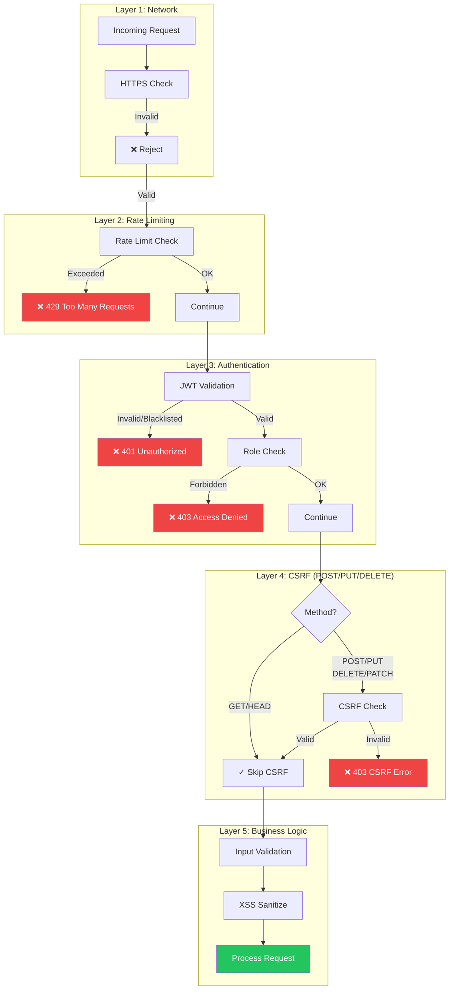

---

## 5. JWT Blacklist (Logout)

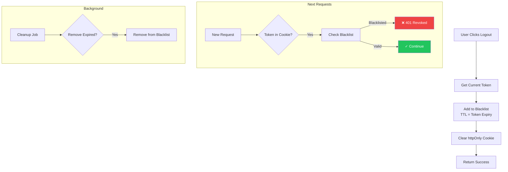

---

## 6. Admin 2FA Flow

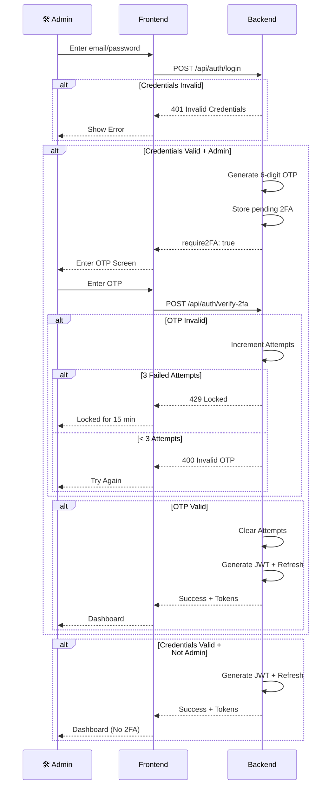

---

## 7. OTP Verification Security

```mermaid
flowchart TD
    A[Driver at Door] --> B[Ask Customer OTP]
    B --> C[Driver Enters OTP]
    C --> D{"Attempts < 3?"}
    
    D -->|Yes| E[Send Verify Request]
    E --> F{OTP Match?}
    
    F -->|Wrong| G[Attempts++]
    G --> D
    
    F -->|Correct| H["✅ Order Delivered<br/>Attempts Cleared"]
    
    D -->|No (≥3)| I["❌ Locked 15 min<br/>Notify Customer"]
    
    style H fill:#22c55e,color:#fff
    style I fill:#ef4444,color:#fff
```

---

## 8. COD Order Spam Protection

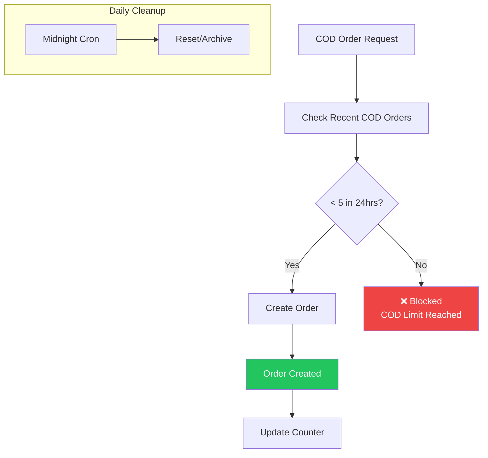

---

## 9. Payment Retry Limits

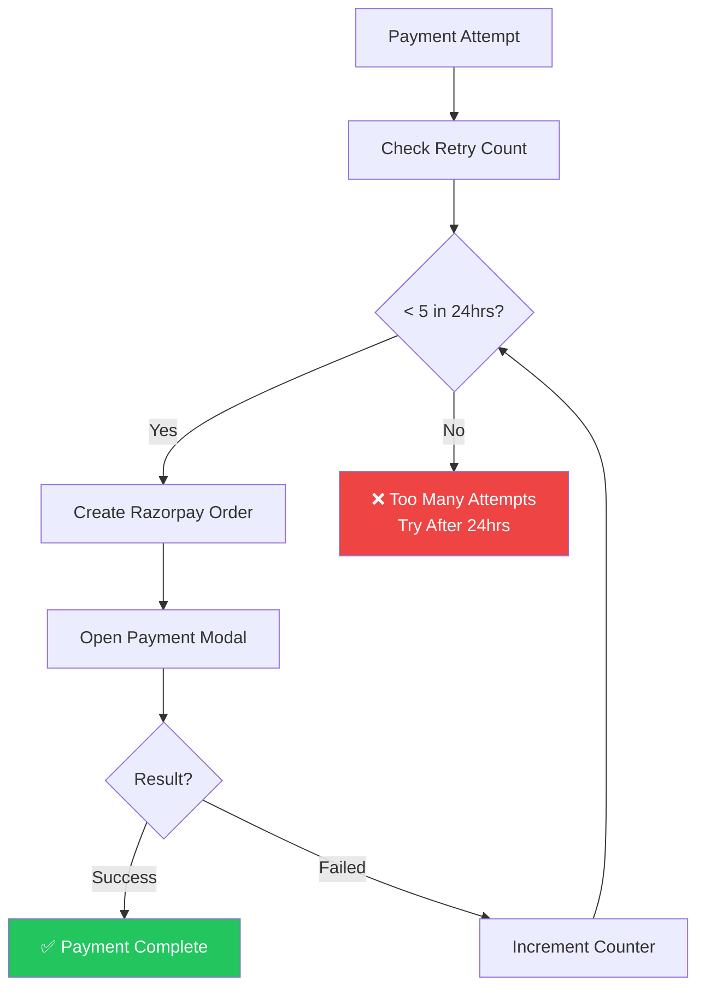

---

## 10. Refresh Token Flow

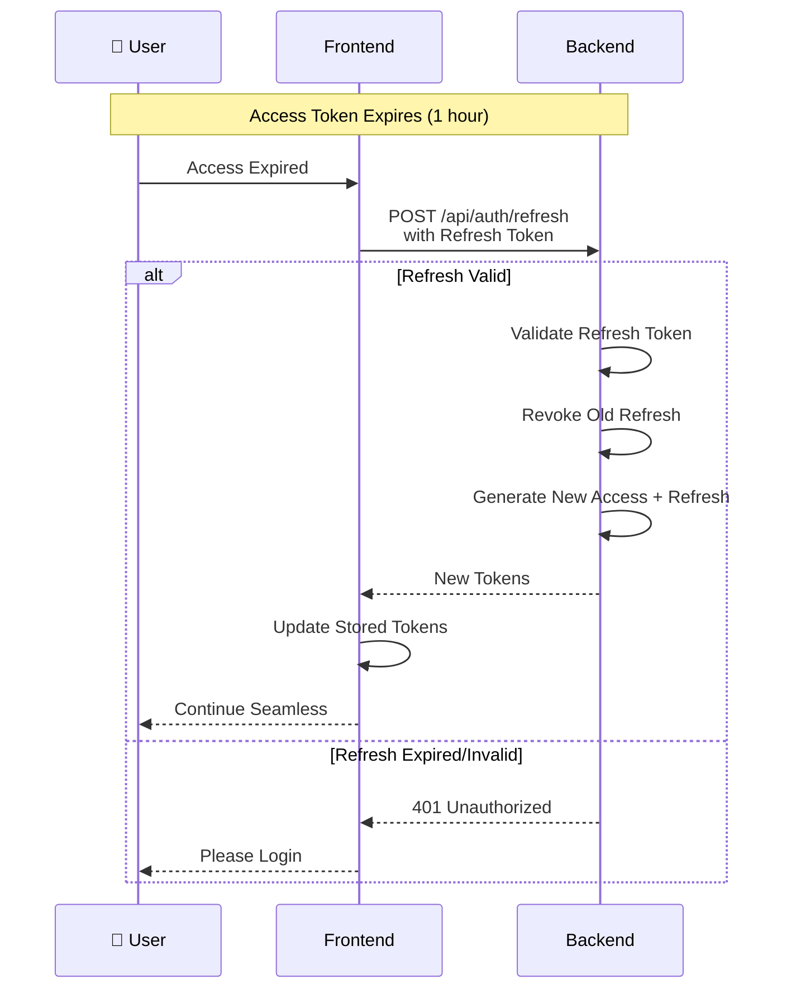

---

## 11. Security Checklist (Updated)

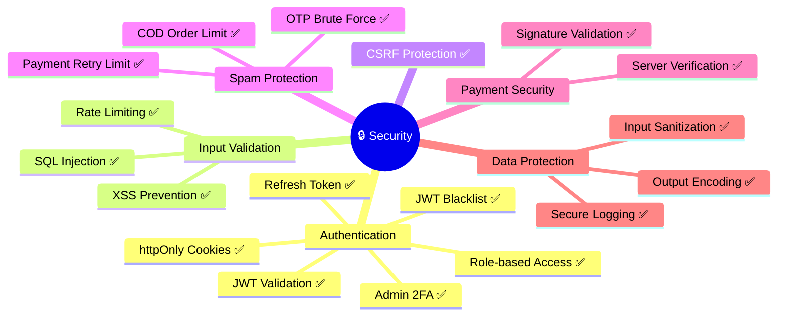

---

## 12. API Security Layers (Updated)

```mermaid
flowchart LR
    subgraph L1["Network"]
        N1[HTTPS/TLS]
    end
    
    subgraph L2["Transport"]
        N2[CORS Origins]
        N2 --> N3[Helmet Headers]
    end
    
    subgraph L3["Rate Limit"]
        N3 --> N4[IP-based Limits]
        N4 --> N5[User-based Limits]
    end
    
    subgraph L4["Auth"]
        N5 --> N6[JWT Validation]
        N6 --> N7[Blacklist Check]
        N7 --> N8[Role Authorization]
    end
    
    subgraph L5["Request"]
        N8 --> N9[CSRF Validation]
        N9 --> N10[Input Validation]
    end
    
    subgraph L6["Output"]
        N10 --> N11[XSS Sanitize]
        N11 --> N12[SQL Safe Queries]
    end
    
    L1 --> L2 --> L3 --> L4 --> L5 --> L6
    
    N12 --> FINAL["✅ Secure"]
    
    style FINAL fill:#22c55e,color:#fff
```

---

## 13. Complete Request Flow

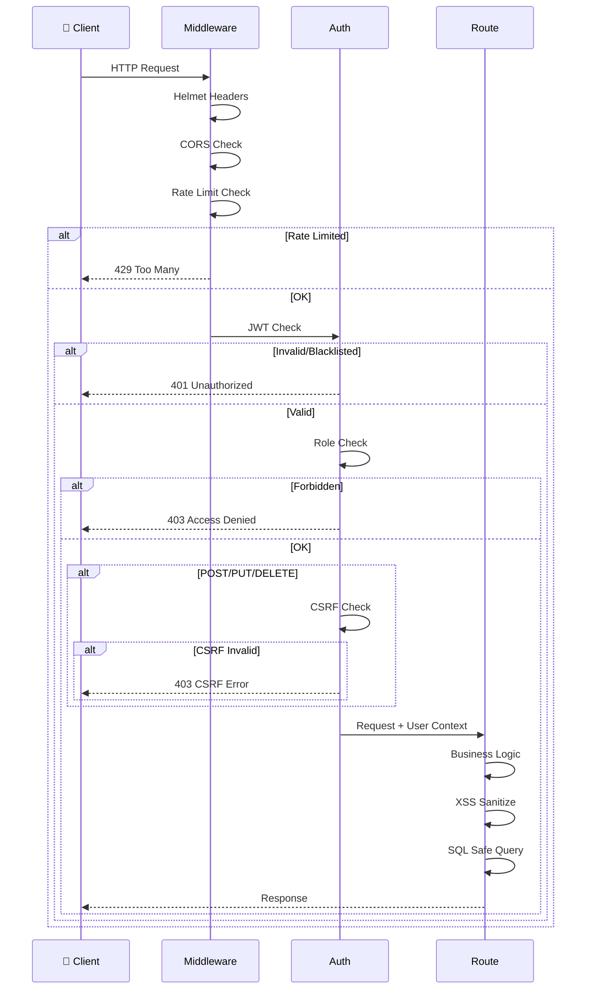

---

## Security Score Comparison

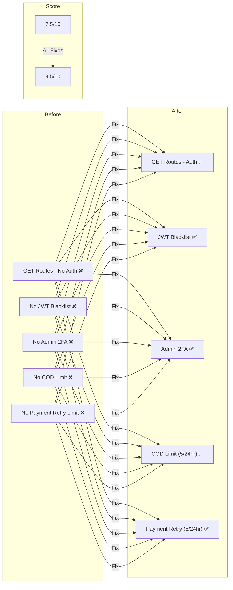

---

## Quick Reference - Security Headers

| Header | Value | Purpose |
|--------|-------|---------|
| Content-Security-Policy | self | XSS Protection |
| X-Content-Type-Options | nosniff | MIME Sniffing |
| SameSite | Strict | CSRF Protection |
| httpOnly | true | XSS Cookie Theft |
| Secure | Production | HTTPS Only |
| X-Frame-Options | DENY | Clickjacking |

---

## Quick Reference - Rate Limits

| Endpoint | Limit | Window |
|----------|-------|--------|
| Auth Login | 5 | 15 min |
| Auth Register | 5 | 15 min |
| API General | 100 | 15 min |
| OTP Verify | 3 | 15 min |
| COD Orders | 5 | 24 hours |
| Payment Retry | 5 | 24 hours |

---

**Status**: ✅ All Security Gaps Fixed!

- ✅ GET routes now have auth (via middleware)
- ✅ JWT Blacklist on logout
- ✅ Admin 2FA with OTP
- ✅ COD order spam protection (5/24hr)
- ✅ Payment retry limits (5/24hr)
- ✅ Refresh token mechanism
- ✅ CORS explicit origins (already done)
